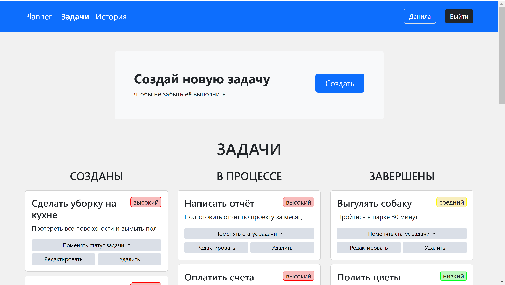
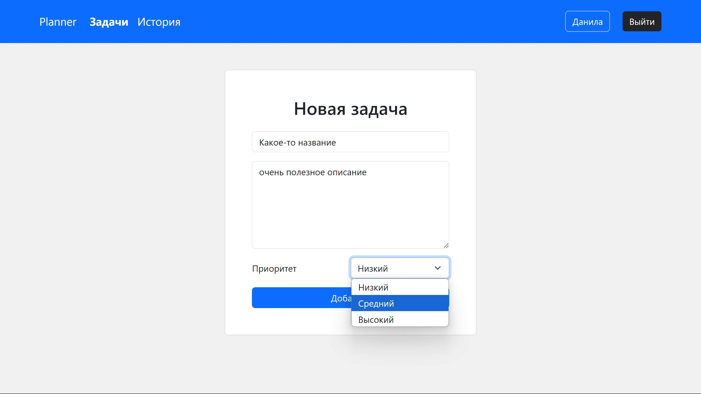

# Task Planner 📝

**Task Planner** - это веб-приложение для управления задачами.

- 🔐 **Авторизация и регистрация**: возможность создать аккаунт и войти в систему.
- 📝 **Создание задач**: задайте название, описание и приоритет задачи.
- 🔄 **Изменение статуса**: перемещайте задачи между категориями.
- ✏️ **Редактирование задач**: изменяйте содержание и приоритет.
- 🗑️ **Удаление задач**: удаляйте ненужные задачи.
- 💾 **Сохранение данных**: все данные хранятся в базе данных PostgreSQL.

## 🛠 Используемые технологии

### Backend
- **FastAPI**: для создания RESTful API.
- **SQLAlchemy**: ORM для работы с базой данных.
- **Alembic**: для управления миграциями базы данных.
- **PostgreSQL**: база данных для хранения данных.
- **Pydantic**: для валидации данных.

### Frontend
- **Jinja2**: рендеринг шаблонов на стороне сервера.
- **JavaScript**: для отправки запросов к API и обновления интерфейса.
> **Примечание:** Во фронтенд-части отображены не все возможности API. Полный функционал доступен через ручки API.

---

## 📂 Структура проекта

```plaintext
fastApiProject/
├── app/
│   ├── api/                
│   │   ├── endpoints/      # Эндпоинты API
│   │   │   ├── __init__.py
│   │   │   ├── account.py  # Управление аккаунтами
│   │   │   ├── main.py     # Основные маршруты
│   │   │   ├── pages.py    # Страницы интерфейса
│   │   │   ├── task.py     # Управление задачами
│   │   │   └── user.py     # Управление пользователями
│   │   ├── schemas/        # Схемы данных (Pydantic)
│   │   │   ├── __init__.py
│   │   │   ├── enums.py    # Перечисления
│   │   │   ├── task_schema.py  # Схемы задач
│   │   │   └── user_schema.py  # Схемы пользователей
│   │   ├── __init__.py
│   │   └── exceptions.py   # Кастомные исключения
│   ├── core/               # Конфигурация приложения
│   │   ├── __init__.py
│   │   └── config.py       # Настройки
│   ├── db/                 # Взаимодействие с базой данных
│   │   ├── __init__.py
│   │   ├── database.py     # Соединение с БД
│   │   ├── interaction.py  # Операции с БД
│   │   ├── models.py       # Модели SQLAlchemy
│   │   └── session_maker.py  # Создание сессий
├── frontend/               # Шаблоны и статические файлы
│   ├── assets/             # CSS, JS
│   └── templates/          # Jinja2-шаблоны
├── migration/              # Файлы миграции Alembic
├── tests/                  # Тесты проекта
├── .env                    # Конфигурация окружения
├── .gitignore              # Исключения для Git
├── alembic.ini             # Конфигурация Alembic
├── requirements.txt        # Список зависимостей
```

---

## 📸 Скриншоты

| Регистрация                              | Вход                                  |
|------------------------------------------|---------------------------------------|
|  |  |
### Главная страница

### Добавление задачи



---
